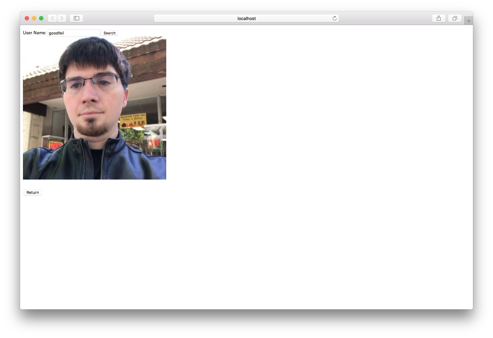
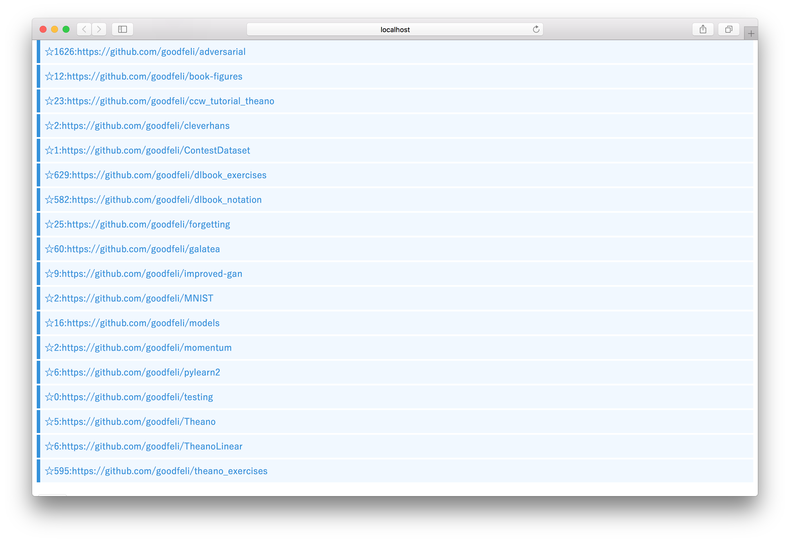

# summer-internship-2018

エウレカサマーインターン2018の技術課題提出用リポジトリです。

## 仕様説明

実行

`yarn`

`yarn start`

### 実現した機能の簡単な解説

GitHubのIDを検索し, 検索ユーザーのアバター画像のURLとリポジトリ情報を取得する.
リポジトリはスター数とそのURLをリストとして表示する.

### スクリーンショット

* 検索画面

* アバター画像表示画面

* リポジトリ&スター数表示画面

## 環境構築マニュアル

* React

* Node.js v8.11.3

## 言語/ライブラリ/アーキテクチャなどの選定理由

### 言語

ReactのJSXの記法が直感的でわかりやすかったので使用しました.
また仮想DOMによるユーザの体感速度向上が見込まれたため, Reactを使用しました.

## こだわりポイント

ファイルサイズを小さくするため, create-react-appを使用せず,
最小限, トランスパイルでbabel, apiリクエスト用にaxiosを利用し,
webpackを用いてビルドしました.