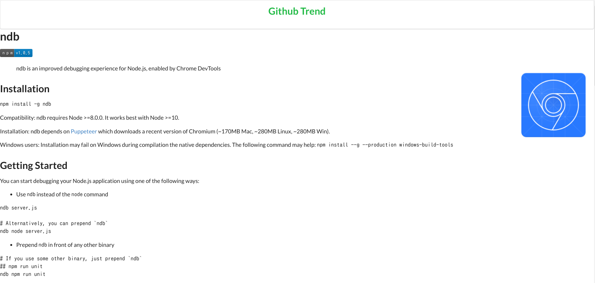

# 仕様説明
## 実装した機能

- Githubのトレンドをリスト形式で表示。  
- レポジトリ名をクリックするとそのレポジトリへ遷移する。  
- see detailをクリックすると詳細画面へ遷移する
  
- Gitub Trendingをスクレイピングしてトレンド情報をJsonで
  返すAPIの作成

### スクリーンショット  
メインページ

詳細画面


# 環境構築マニュアル
Arch linux環境では動作を確認しました。
1. APIサーバの起動
```
cd server
pip3 install -r requirements.txt
python3 app.py
```
2. フロントの起動
``` 
cd front
npm install
npm run dev
```
3. ブラウザを開いて確認
```
localhost:3000
```


# 言語/ライブラリ/アーキテクチャなどの選定理由
## 使用言語/フレームワーク/ライブラリ
### バックエンド
- Python  
    - Flask
    - Beautifulsoup  
  
Githubのトレンド情報を取得するためにスクレイピングをしなければならなかっためスクレイピングのためのライブラリが充実しているPythonを選択。またapiサーバーを立てるため軽量なwebフレームワークであるFlaskを選定。
アーキテクチャとしてはMVCを採用したがあまり活用できてないような気がします。
### フロントエンド
- Javascript 
    - Nuxt.js
    - axios
    - vue-markdown  
    - semantic-ui  
  
Nuxt.jsはお手軽にSSRできるし、今回は小規模のサイトで複雑な構成にならないと思ったためNuxt.jsを選択
semantic-uiは興味があって使いました。


# こだわりポイント  
- フロントエンドとバックエンドの分離を意識しました。
- 作成に必要なAPIを自作したこと。
- フロントエンド苦手だけどちょっぴりおしゃれにしたこと

- スクレイピングは処理に時間がかかるのでそこは非同期で取ってきて
後でレンダリングするようにした。
