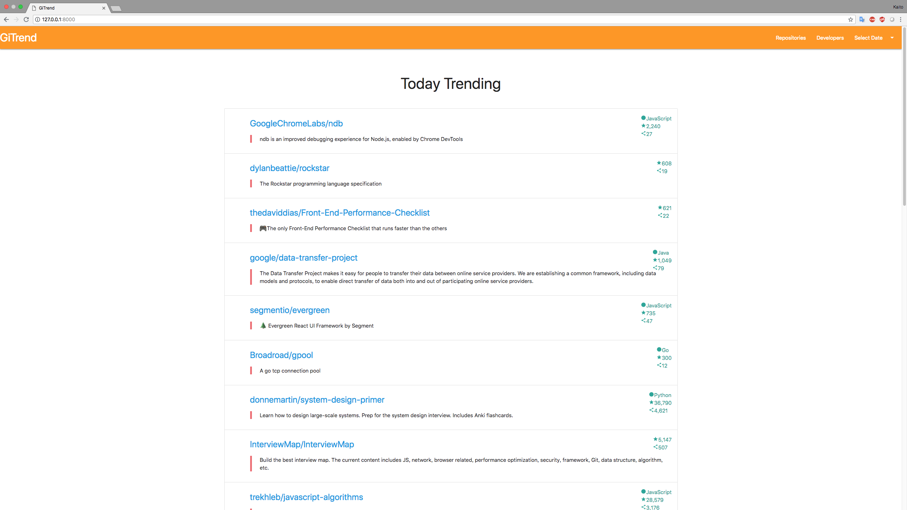
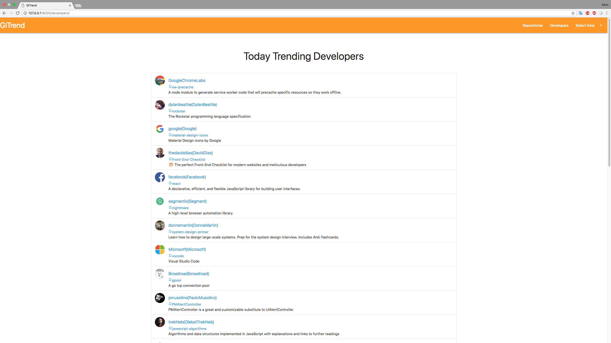
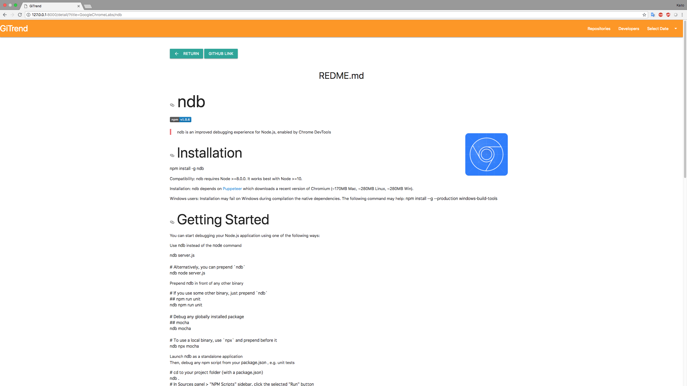

## 仕様説明
### 実現した機能の簡単な解説
GitHubのtrend・developers・repositoryをスクレイピングする機能を実装している。  
また、クエリパラメーターを渡すことでtoday・week・monthでトレンドを表示する。  
README.mdは、スクレイピングでhtmlを取得しそのまま表示している。  

### スクリーンショット




## 環境構築マニュアル
```
# 開発環境
macOS Sierra 10.13.4
Python 3.6.4
Django 2.0.7
Beautifulsoup4 4.6.0
```

1.Djangoのインストール
```
$ pip install django
```

2.Beautifulsoup4のインストール
```
$ pip install beautifulsoup4
$ pip install lxml
```

### 起動方法

```
$ cd summer-internship-2018/github_trend_project/
$ python manager.py runserver
```

## 言語/ライブラリ/アーキテクチャなどの選定理由
- Python 3系   
普段から利用している言語なので、短い期間でWebアプリを作成することが可能だと思い選択しました。

- ライブラリ  
Webフレームワーク: Django
スクレイピング: Beautifulsoup4
CSSフレームワーク: Materialize

Webフレームワークは、利用したことがあったのでこちらを用いることで素早い開発が実現できた。
スクレイピングは、使い慣れているものを利用しました。
CSSフレームワークは、マテリアルデザインが簡単に実現できるものを使ってみました。

- アーキティクチャ  
スクレイピンしたデータを表示するといったシンプルなアーキティクチャにしました。

## こだわりポイント
- 可読性が高くなるようにコードを書いたこと
- マテリアルデザインを用いて見る人がなるべくわかりやすいようにしたこと
- ほぼjsを利用していないこと
- 複雑な実装にするのではなくシンプルな実装にしたこと

## 課題
- エラー処理を全く書いてないこと
- 細かいデザインの修正
- 第三者から評価をいただいて改良する
