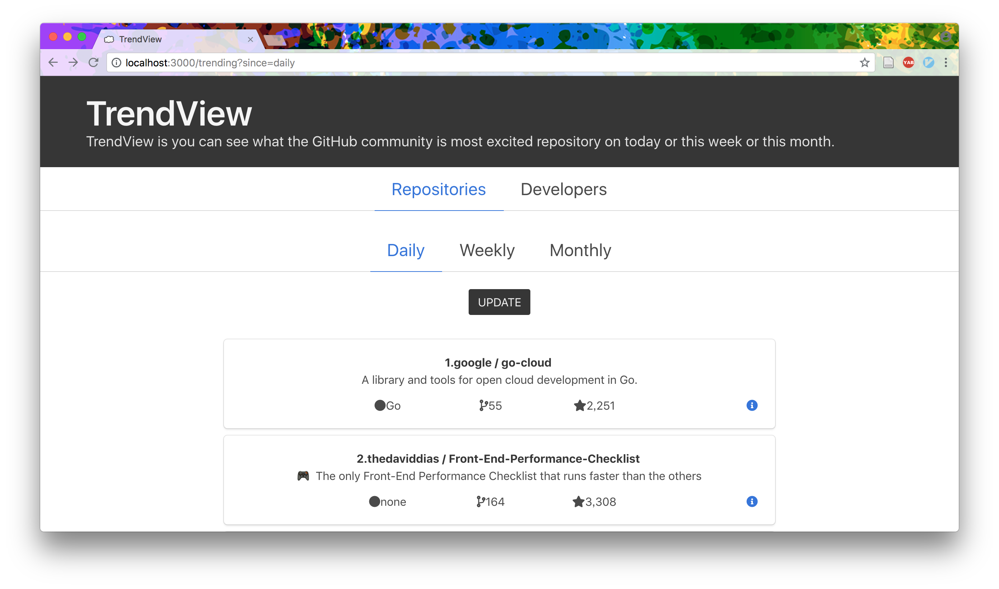
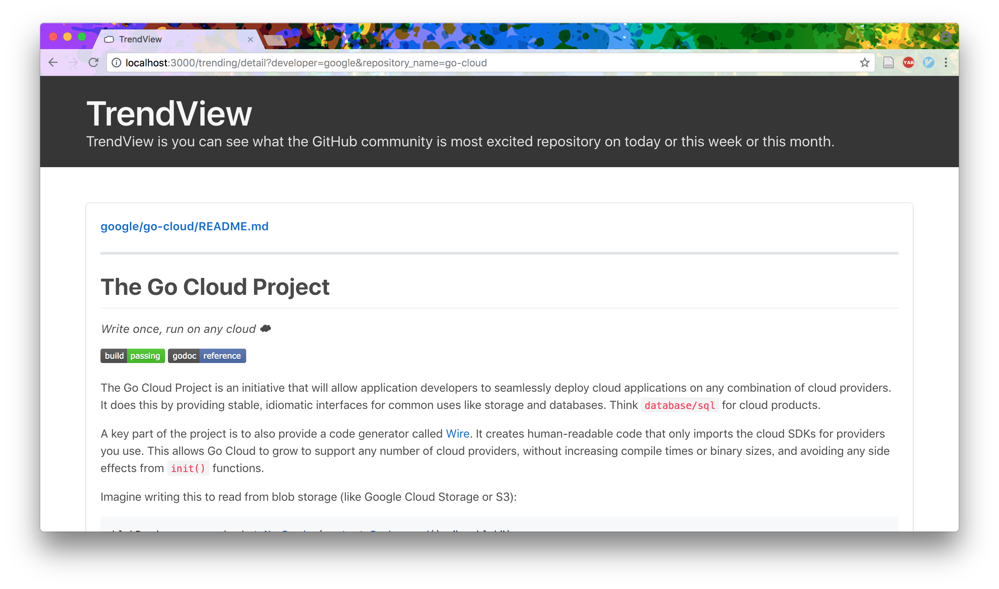

# summer-internship-2018

エウレカサマーインターン2018の技術課題提出用リポジトリです。

### 課題1
1. [GitHubトレンド](https://github.com/trending)をリスト形式で表示できるサイトを作成してください
2. リスト押下で詳細な情報が閲覧できる画面に遷移してください
3. リストおよび詳細画面に表示する情報は自由に決めてください

### 実装した機能の簡単な解説
[GitHubトレンド](https://github.com/trending)に記載されているリポジトリ，デベロッパーの一覧をスクレイピングによって取得する。さらに，リポジトリ，またはデベロッパーの一覧を選択すると同時に，Daily/Weekly/Monthlyを選択することが可能。

## スクリーンショット
### タイトル


### トレンド一覧 (リポジトリ)


### トレンド一覧 (デベロッパー)


### リポジトリ詳細画面



## 開発環境
- Macbook Pro (Retina, 13-inch, Late 2013)
  - OS : MacOS Sierra 10.12.6
  - メモリ : 8GB
  - プロセッサ : 2.4GHz Intel Core i5
- plenv v2.2.0-12-g75267ce
  Perl5系のバージョン管理ツール
- Perl 5.22.0
- cpanm v1.7044
  CPANという有志がPerlモジュールを公開しているアーカイブサイトから，モジュールをインストールするために必要なツール
- Carton v1.0.28
  Rubyで言う所のbundleで，容易に複数のCPANモジュールのバージョン管理やインストールを行うことができるツール
- Mojolicious v7.30
  Perl5で現在も改良が進められており，小規模から大規模まで対応が可能なWebアプリケーションフレームワーク
- Bulma
  フロントエンドに熟達していない自分でも見た目を整えることができる，軽量で手軽に扱えるCSSフレームワーク。


### 環境構築マニュアル

1. 初めにplenvをinstallします
```
$ git clone git://github.com/tokuhirom/plenv.git ~/.plenv
$ git clone git://github.com/tokuhirom/Perl-Build.git ~/.plenv/plugins/perl-build/
$ echo 'export PATH="$HOME/.plenv/bin:$PATH"' >> ~/.your_profile
$ echo 'eval "$(plenv init -)"' >> ~/.your_profile
$ exec $SHELL -l
```
2. 次にPerl v5.22.0をinstallします
```
$ plenv install 5.22.0
```
3. installしたPerlを扱うために，plenvで使用するPerlのバージョンを先ほどinstallしたPerlのバージョンに固定します
```
$ export PLENV_VERSION=5.22.0
```
4. 次にcpanmのinstallをします
```
$ plenv install-cpanm
```
5. 最後にCartonのinstallをします
```
$ cpanm install Carton
```

## 起動手順

1. このリポジトリをクローンします
```
$ git clone https://github.com/NoritomoTaba/summer-internship-2018.git
```
2. branchを切り替えます。
```
$ cd ./summer-internship-2018
$ git checkout NoritomoTaba
```
3. carton を用いて，依存モジュールのinstallを行います。
```
$ carton install
```
4. serverを起動
```
$ carton exec hypnotoad script/trend_view
```
5. `localhost:8080`に接続し，ページが表示されていたら環境構築終了

## 言語/ライブラリ/アーキテクチャなどの選定理由
- Perl5
  Programingを真面目に勉強するきっかけを与えてくれた言語で，よく触っているからです。
- Furl & HTML::TreeBuilder
  スクレイピングを行う時は普段からこの2つのモジュールを組み合わせて使っています。理由としては，コンテンツの取得からHTMLのParseまで直感的に行うことができ使いやすいためです。
- アーキテクチャ
  コントローラー側でスクレイピングしたデータをビューに投げるだけのシンプルなものです。アーキテクチャさえシンプルなものにしてしまえば開発が容易になると考えたためです。

## こだわりポイント
 - 今自分が何のトレンドでいつの期間のものを見ているか把握できるようにトレンド一覧のすぐ上に選択したトレンドの種類と期間を見えるようにしたところ
