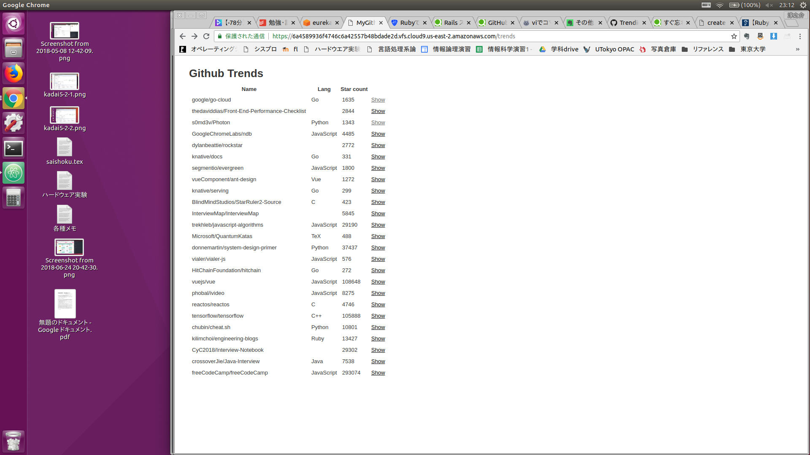

## 仕様説明
### 実装した機能
githubトレンドをリスト形式で表示できるようにしました。リストの項目を押下すると各リポジトリのreadmeが見れるようになっています。

### スクリーンショット

## 環境構築マニュアル
macOS Sierra 10.12.6
PHP 7.1.8

MAMPをインストールしてこのリポジトリをMAMPで設定したrootパスに配置して、http://localhost/summer-internship-2018/index.php

にアクセスしてください。

MAMPインストール方法
https://techacademy.jp/magazine/5102

MAMPでなくてもPHP7が動く環境であれば動きます

## 言語/ライブラリ/アーキテクチャなどの選定理由
- 言語:PHP 7.1.8
  - 普段から使っている言語でphpQueryも使いやすそうだったから。
- ライブラリ: phpQuery
  - phpのスクレイピングをするライブラリの中で一番使いやすそうだったから。
- アーキテクチャ
  - サイトにアクセスすると同期的にgithubから情報を取得する。githubトレンドのリストがいつ更新されるか分かればcronでその都度更新して情報を格納するほうが速度は上がると思う。
## こだわりポイント
時間がなかったので出来るだけ早くMVPを作るよう心がけた。

フロントエンド、特に詳細ページのreadmeはもう少し整えたかった。